# dev-workflow

Generic agent orchestration plugin for [Claude Code](https://docs.anthropic.com/en/docs/claude-code). Structured workflows with 7 specialized agents, config-driven everything, run observability, and DX commands.

> **One config file. Any project. Full quality pipeline.**

---

## Architecture Overview

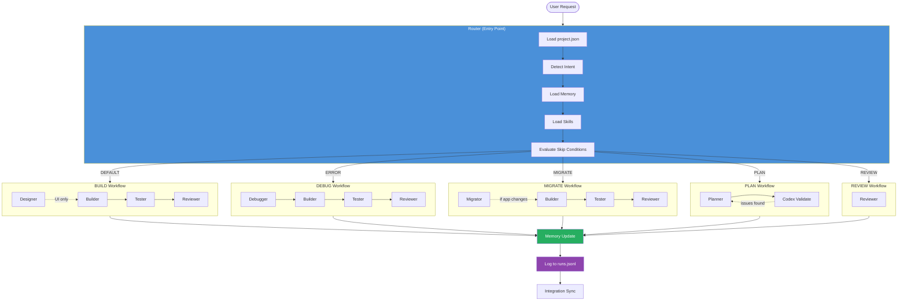

## Agent Contract Flow

Every agent produces a structured JSON contract. The router validates it before unblocking the next agent.

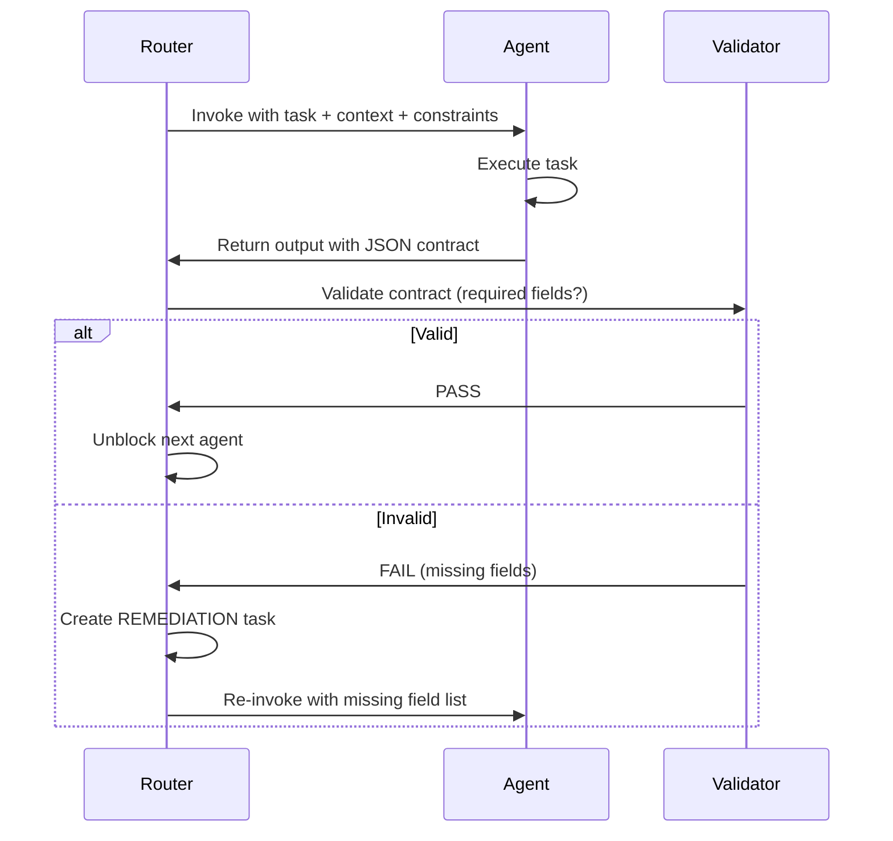

## Agents

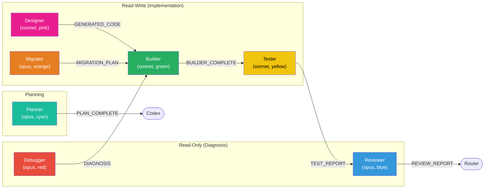

| Agent | Role | Contract Artifact |
|-------|------|-------------------|
| **Debugger** | Root cause analysis — REPRO, ROOT_CAUSE, FIX_HYPOTHESIS | `DIAGNOSIS` |
| **Designer** | UI generation via Gemini MCP | `DESIGNER_COMPLETE` |
| **Builder** | Implementation with TDD evidence | `BUILDER_COMPLETE` |
| **Tester** | Test execution with exit codes | `TEST_REPORT` |
| **Reviewer** | Security/pattern validation (read-only) | `REVIEW_REPORT` |
| **Planner** | Specs + task breakdown | `PLAN_COMPLETE` |
| **Migrator** | DB migrations with up/down + rollback | `MIGRATION_PLAN` |

## Feedback Loops

When tests fail or reviewer requests changes, the router automatically retries the builder with failure context.

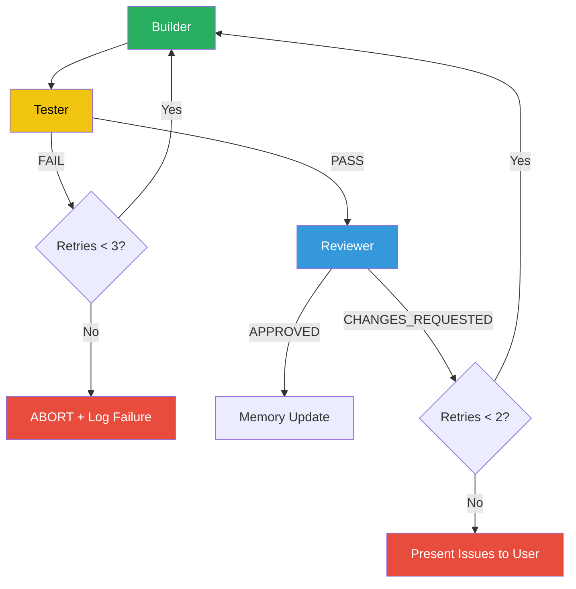

| Loop | Trigger | Max Retries | Config Key |
|------|---------|-------------|------------|
| Tester → Builder | `TEST_REPORT.result == "FAIL"` | 3 | `agents.retry_limits.tester_fail` |
| Reviewer → Builder | `REVIEW_REPORT.final_status == "CHANGES_REQUESTED"` | 2 | `agents.retry_limits.reviewer_changes` |
| Codex → Planner | `CODEX_REVIEW: ISSUES_FOUND` | 3 | (built-in) |

## Workflow Chains

```mermaid
graph TD
    subgraph "BUILD (non-UI)"
        B1[Builder] --> B2[Tester] --> B3[Reviewer] --> B4[Memory]
    end

    subgraph "BUILD (UI)"
        U0[Designer<br/><i>Gemini MCP</i>] --> U1[Builder] --> U2[Tester] --> U3[Reviewer] --> U4[Memory]
    end

    subgraph "DEBUG"
        D0[Debugger] --> D1[Builder] --> D2[Tester] --> D3[Reviewer] --> D4[Memory]
    end

    subgraph "MIGRATE"
        M0[Migrator] -.-> M1[Builder] --> M2[Tester] --> M3[Reviewer] --> M4[Memory]
    end

    subgraph "HOTFIX (fast-path)"
        H0[Debugger] --> H1[Builder] --> H2[Tester<br/><i>targeted only</i>] --> H3[Memory + Postmortem]
    end

    subgraph "PLAN"
        P0[Planner] --> P1[Codex Validate] -.->|issues| P0
        P1 --> P2[Memory]
    end

    subgraph "DESIGN (standalone)"
        DS0[Designer<br/><i>Gemini MCP</i>] --> DS1[User Review] -.->|iterate| DS0
        DS1 --> DS2[Save + Memory]
    end

    subgraph "REVIEW"
        R0[Reviewer] --> R1[Memory]
    end

    subgraph "SPRINT (parallel)"
        S0[Planner] --> S1[TeamCreate]
        S1 --> S2a[Builder 1<br/><i>worktree A</i>]
        S1 --> S2b[Builder 2<br/><i>worktree B</i>]
        S1 --> S2c[Builder 3<br/><i>worktree C</i>]
        S2a --> S3[Merge]
        S2b --> S3
        S2c --> S3
        S3 --> S4[Tester] --> S5[Reviewer] --> S6[Memory]
    end

    style U0 fill:#e91e8e,color:#fff
    style D0 fill:#e74c3c,color:#fff
    style H0 fill:#e74c3c,color:#fff
    style M0 fill:#e67e22,color:#fff
    style DS0 fill:#e91e8e,color:#fff
    style P1 fill:#8e44ad,color:#fff
    style S1 fill:#9b59b6,color:#fff
    style S2a fill:#27ae60,color:#fff
    style S2b fill:#27ae60,color:#fff
    style S2c fill:#27ae60,color:#fff
```

## Skills (Commands)

| Command | Purpose | When to Use |
|---------|---------|-------------|
| `/dev-workflow-router` | Auto-detect intent, run full chain | Any dev task |
| `/dev-workflow-init` | Bootstrap project: detect stack, install skills | New project or re-configure |
| `/dev-workflow-init search <q>` | Search skills.sh marketplace | Find new skills |
| `/dev-workflow-scan` | Auto-generate patterns + constraints from codebase | After init or anytime |
| `/dev-workflow-sprint` | Parallel build with agent teams + worktrees | Multiple features at once |
| `/dev-workflow-design` | Generate + iterate UI with Gemini | Before building UI |
| `/dev-workflow-plan` | Plan + Codex validation | Before major features |
| `/dev-workflow-hotfix` | Fast incident response | Production bugs |
| `/dev-workflow-status` | View tasks, runs, memory state | Check progress |
| `/dev-workflow-doctor` | Config, MCP, memory health check | Troubleshooting |
| `/dev-workflow-pr` | Generate PR from agent artifacts | After build completes |

## Memory System

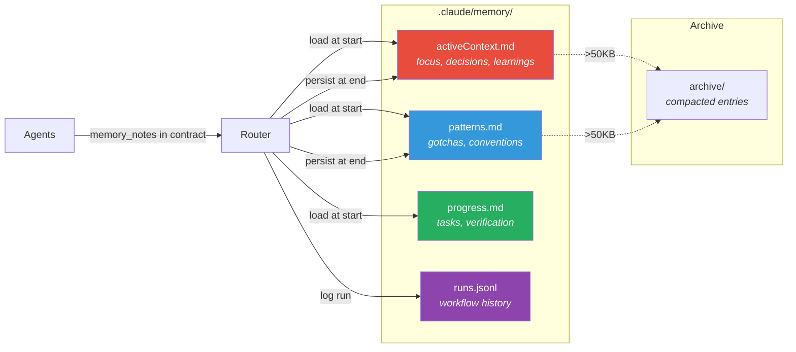

| File | Purpose | Anchors |
|------|---------|---------|
| `activeContext.md` | Current focus, decisions, learnings, references | `## Current Focus`, `## Decisions`, `## Learnings`, `## References` |
| `patterns.md` | Architecture, conventions, gotchas | `## Architecture Patterns`, `## Common Gotchas` |
| `progress.md` | Task tracking, verification evidence | `## Tasks`, `## Completed`, `## Verification` |
| `runs.jsonl` | Workflow execution log (append-only) | N/A (JSONL) |

**Hygiene:** Files > 50KB trigger compaction warning. Old entries archived to `.claude/memory/archive/`.

## Config (`project.json`)

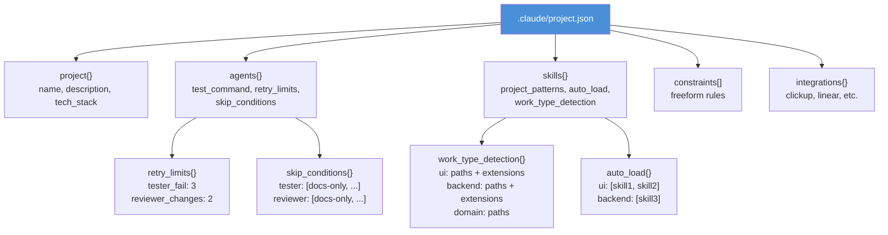

```json
{
  "version": "1.0",
  "project": {
    "name": "my-app",
    "description": "My project",
    "tech_stack": ["typescript", "next.js"]
  },
  "agents": {
    "tester": { "test_command": "npm test" },
    "retry_limits": { "tester_fail": 3, "reviewer_changes": 2 },
    "skip_conditions": {
      "tester": ["docs-only", "config-only", "user-says-skip"],
      "reviewer": ["docs-only", "config-only", "user-says-skip"],
      "designer": []
    }
  },
  "skills": {
    "project_patterns": ".claude/skills/project-patterns/SKILL.md",
    "auto_load": { "ui": ["ui-ux-pro-max"], "backend": [] },
    "work_type_detection": {
      "ui": { "paths": ["components/"], "extensions": [".tsx"] },
      "backend": { "paths": ["api/"], "extensions": [".ts"] }
    }
  },
  "constraints": ["Components < 300 lines"],
  "integrations": {}
}
```

## Skip Conditions

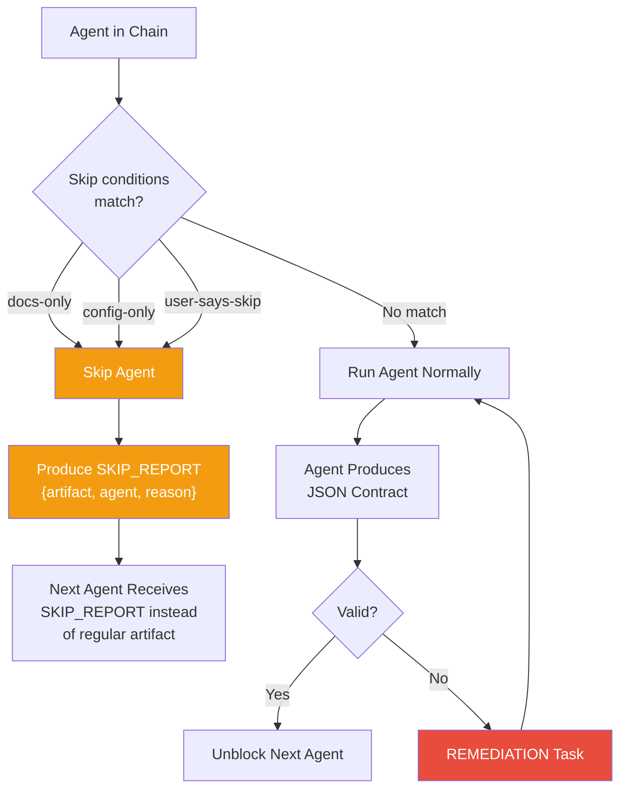

## Quick Start

### Option A: Skills CLI (Recommended)

```bash
npx skills add vlady98ish/claude-dev-workflow -y
```

### Option B: Claude Code Marketplace

```
/plugin marketplace add vlady98ish/claude-dev-workflow
/plugin install dev-workflow@dev-workflow
```

### Option C: Git Clone

```bash
git clone https://github.com/vlady98ish/claude-dev-workflow.git
```

Then add to your project's `CLAUDE.md`:
```markdown
**For ANY development task → invoke `dev-workflow-router` skill FIRST. Never bypass.**
```

All methods: start working — the router auto-activates and bootstraps on first use.

### What Happens on First Run

On first run, the router auto-detects your tech stack and bootstraps everything:

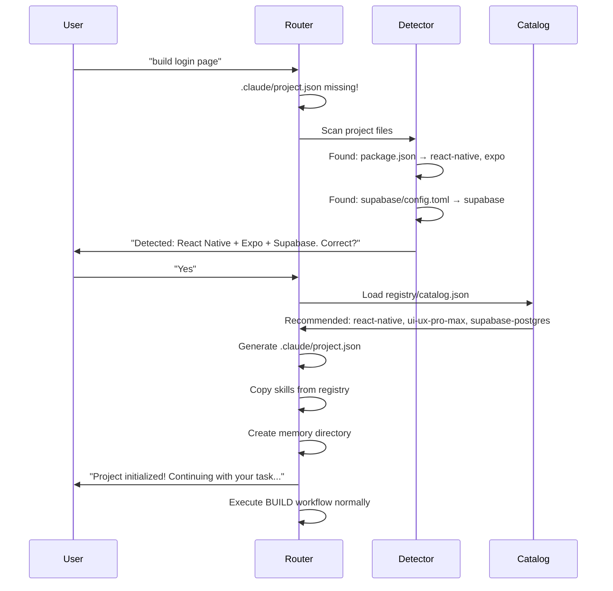

Or run `/dev-workflow-init` manually for guided setup.

### Alternative: Manual Setup

If you prefer manual control:
1. Copy `templates/project.json` to `.claude/project.json`
2. Add `project-patterns/SKILL.md` with your conventions
3. Copy skills from `registry/skills/` as needed
4. Run `/dev-workflow-doctor` to verify

## Skill Registry + skills.sh Marketplace

Skills are installed from [skills.sh](https://skills.sh/) marketplace via `npx skills add`. The catalog maps detected stacks to recommended skills automatically.

### Pre-Configured Skills (auto-recommended per stack)

| Stack | Recommended Skills | Optional |
|-------|-------------------|----------|
| **React Native** | vercel-react-native (44K), ui-ux-pro-max, expo-native-ui (14K), expo-deployment (7.9K) | callstack-react-native, expo-data-fetching, expo-tailwind |
| **Next.js** | vercel-react (179K), web-design-guidelines (138K), nextjs-app-router (6.1K), webapp-testing (16K) | tailwind-design-system, frontend-design |
| **Vue/Nuxt** | web-design-guidelines (138K), webapp-testing (16K) | tailwind-design-system, frontend-design |
| **Python** | python-testing (5.4K) | — |
| **Supabase** | supabase-postgres (26K) | nextjs-supabase-auth |

### Search for More Skills

```bash
# Via CLI directly
npx skills find react-native
npx skills find testing
npx skills find tailwind

# Via dev-workflow
/dev-workflow-init search <query>
```

Browse skills at [skills.sh](https://skills.sh/) | [claudemarketplaces.com](https://claudemarketplaces.com/) | [skillsmp.com](https://skillsmp.com/)

### Adding Custom Skills

**From marketplace:** `npx skills add owner/repo@skill-name`

**Local:** Create `.claude/skills/{name}/SKILL.md` in your project.

**Bundled fallbacks:** `registry/skills/` contains offline copies of key skills (vercel-react-native, ui-ux-pro-max, supabase-postgres) for use without internet.

## Design → Build Pipeline

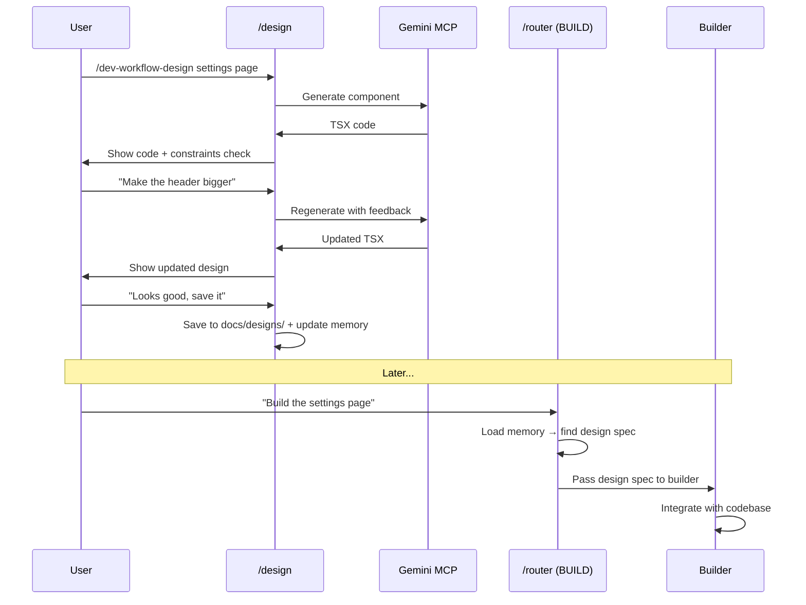

## Hotfix Flow

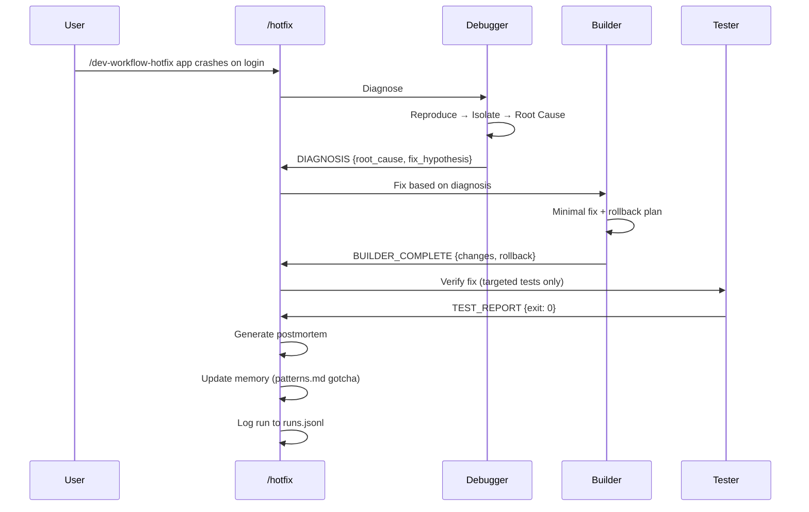

## Project Structure

```
claude-dev-workflow/
├── .claude-plugin/
│   └── plugin.json                   # Plugin manifest
├── agents/
│   ├── builder.md                    # Implementation specialist
│   ├── debugger.md                   # Root cause analysis
│   ├── designer.md                   # UI generation (Gemini MCP)
│   ├── migrator.md                   # DB migrations
│   ├── planner.md                    # Architecture & planning
│   ├── reviewer.md                   # Security & patterns (read-only)
│   └── tester.md                     # Quality assurance
├── registry/
│   ├── catalog.json                  # Stack detection + skill mapping
│   └── skills/                       # Pre-built tech skills
│       ├── vercel-react-native-skills/  # React Native + Expo
│       ├── ui-ux-pro-max/               # UI/UX design intelligence
│       └── supabase-postgres-best-practices/  # Supabase + Postgres
├── skills/
│   ├── dev-workflow-router/SKILL.md  # Entry point & orchestration
│   ├── dev-workflow-init/SKILL.md    # Project bootstrap + auto-detect
│   ├── dev-workflow-scan/SKILL.md   # Auto-generate patterns from code
│   ├── dev-workflow-sprint/SKILL.md # Parallel build with agent teams
│   ├── dev-workflow-memory/SKILL.md  # Memory management + hygiene
│   ├── dev-workflow-design/SKILL.md  # UI design iteration
│   ├── dev-workflow-plan/SKILL.md    # Manual plan + Codex
│   ├── dev-workflow-hotfix/SKILL.md  # Production fast-path
│   ├── dev-workflow-status/SKILL.md  # Workflow status + runs
│   ├── dev-workflow-doctor/SKILL.md  # Health diagnostics
│   └── dev-workflow-pr/SKILL.md      # PR automation
├── templates/
│   ├── project.json                  # Example config
│   └── project-patterns/SKILL.md    # Example patterns skill
├── CLAUDE.md                         # Router activation (3 lines)
└── README.md                         # This file
```

## Per-Project Files

| File | Purpose | Required? |
|------|---------|-----------|
| `.claude/project.json` | Project config | Yes |
| `.claude/skills/project-patterns/SKILL.md` | Project conventions | Optional |
| `.claude/memory/*.md` | Memory files | Auto-created |
| `.claude/memory/runs.jsonl` | Run history | Auto-created |
| `.claude/skills/{name}/SKILL.md` | Additional skills | Optional |
